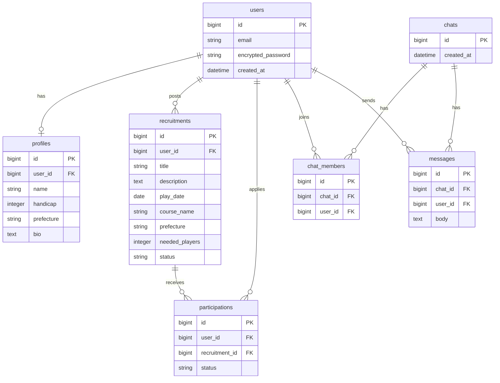

# Golf Matching App

ゴルファー同士がラウンドの仲間を募集・マッチングできるWebアプリです。

## 技術スタック

| 層 | 技術 |
|---|---|
| バックエンド | Ruby on Rails 7.1 (API mode) |
| チャット | Action Cable (WebSocket) |
| フロントエンド | Vue 3 + Vite + Tailwind CSS |
| データベース | PostgreSQL 16 |
| 認証 | Devise + devise-jwt (JWT) |
| コンテナ | Docker / Docker Compose |

## 機能

- メンバー登録・ログイン（JWT認証）
- ゴルフラウンド募集の投稿・一覧・詳細
- 募集への参加申請・承認・却下
- プロフィール編集
- チャット機能

## ER図


## ディレクトリ構成
```
golf-matching/
├── docker-compose.yml
├── .env.example
├── backend/              # Rails API
│   ├── app/
│   │   ├── controllers/
│   │   │   └── api/v1/
│   │   ├── models/
│   │   └── presenters/
│   └── db/
│       └── migrate/
└── frontend/             # Vue 3 SPA
    ├── src/
    │   ├── components/
    │   ├── pages/
    │   ├── router/
    │   └── lib/
    └── ...
```

## 起動手順

### 1. 環境変数の準備
```bash
cp .env.example .env
```

### 2. コンテナ起動
```bash
docker compose up --build
```

### 3. 動作確認

- フロントエンド: http://localhost:5173
- Rails API: http://localhost:3000

## 主なAPIエンドポイント

| メソッド | パス | 説明 |
|---|---|---|
| POST | /api/v1/users/sign_up | 会員登録 |
| POST | /api/v1/users/sign_in | ログイン |
| GET | /api/v1/recruitments | 募集一覧 |
| POST | /api/v1/recruitments | 募集投稿 |
| GET | /api/v1/recruitments/:id | 募集詳細 |
| POST | /api/v1/recruitments/:id/participations | 参加申請 |
| PATCH | /api/v1/participations/:id | 申請承認・却下 |
| GET | /api/v1/profile | プロフィール取得 |
| PATCH | /api/v1/profile | プロフィール更新 |
